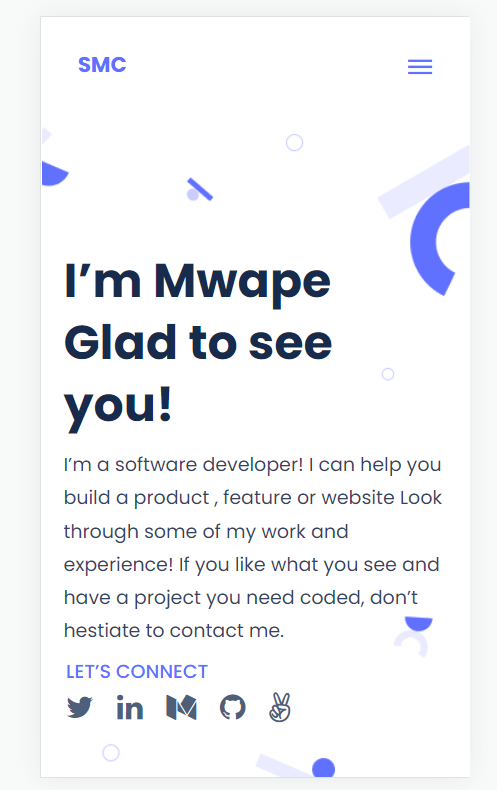



# My Portfolio

> Building a Portfolio to show what I'm truly capable of as a developer, as well as showing my future recruiters and hiring managers to get an idea of what I can bring to their teams.

## Demo link
[Click Here](https://mwapsam.github.io/portifolio/)

Additional description about the project and its features.

## Built With

- Major languages
- HTML
- CSS

## Getting Started

**This is an example of how you may give instructions on setting up your project locally.**
**Modify this file to match your project, remove sections that don't apply. For example: delete the testing section if the currect project doesn't require testing.**

To get a local copy up and running follow these simple example steps.

### Prerequisites

- HTML
- CSS
- Linters

### Setup

git clone https://github.com/Mwapsam/portifolio.git

cd portfolio

### Install

npm init -y
